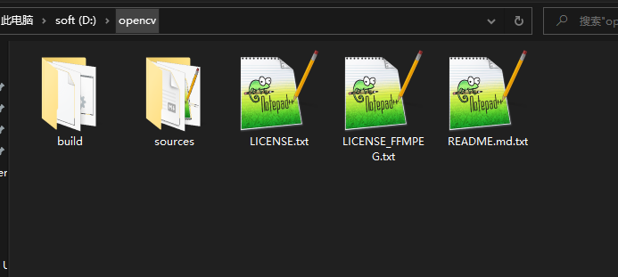
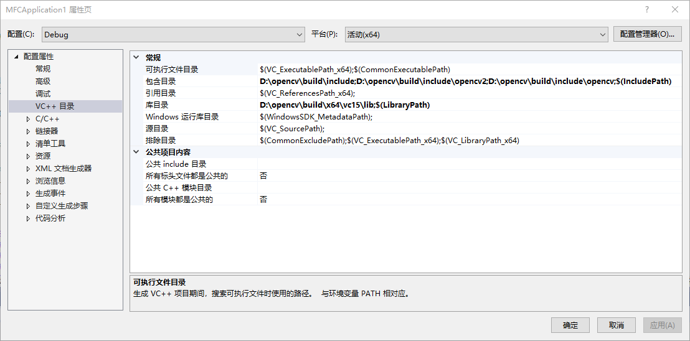
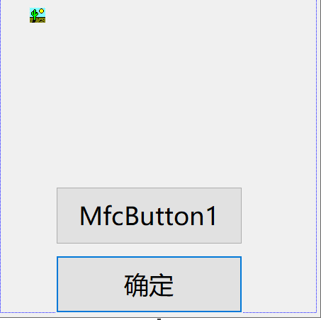
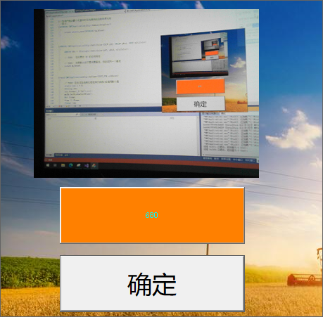

# opencv3 cam on mfc picture control example

>  wvv 20210910

1. download and config opencv3 environment



2. create mfc dialog project, and add the opencv path to the include and library directory.




3. add a picture control  and two mfc button to the dialog.

   

4. the core code

```c++
int Mat2CImage(Mat* mat, CImage& img) 
{
	if (!mat || mat->empty())
		return -1;
	int nBPP = mat->channels() * 8;
	img.Create(mat->cols, mat->rows, nBPP);
	if (nBPP == 8)
	{
		static RGBQUAD pRGB[256];
		for (int i = 0; i < 256; i++)
			pRGB[i].rgbBlue = pRGB[i].rgbGreen = pRGB[i].rgbRed = i;
		img.SetColorTable(0, 256, pRGB);
	}
	uchar* psrc = mat->data;
	uchar* pdst = (uchar*)img.GetBits();
	int imgPitch = img.GetPitch();
	for (int y = 0; y < mat->rows; y++)
	{
		memcpy(pdst, psrc, mat->cols * mat->channels());//mat->step is incorrect for those images created by roi (sub-images!)
		psrc += mat->step;
		pdst += imgPitch;
	}
	return 0;
}
BOOL CMFCApplication1Dlg::OnInitDialog()
{
	CDialogEx::OnInitDialog();
	// 设置此对话框的图标。  当应用程序主窗口不是对话框时，框架将自动
	//  执行此操作
	SetIcon(m_hIcon, TRUE);			// 设置大图标
	SetIcon(m_hIcon, FALSE);		// 设置小图标

	// TODO: 在此添加额外的初始化代码
	CImage img;
	img.LoadFromResource(AfxGetInstanceHandle(), MAKEINTRESOURCE(IDB_BITMAP4));
	CBitmap bmpTmp;
	bmpTmp.Attach(img.Detach());
	m_brush.CreatePatternBrush(&bmpTmp);

	mtfb.EnableWindowsTheming(FALSE);
	mtfb.SetFaceColor(RGB(255, 128, 0));
	mtfb.SetTextColor(RGB(0, 255, 255));
	cap = new VideoCapture(0);
	cap->set(CV_CAP_PROP_FRAME_WIDTH, 320);
	cap->set(CV_CAP_PROP_FRAME_HEIGHT, 240);
	SetTimer(1, 33, NULL);
	return TRUE;  // 除非将焦点设置到控件，否则返回 TRUE
}
void CMFCApplication1Dlg::OnTimer(UINT_PTR nIDEvent)
{
	// TODO: 在此添加消息处理程序代码和/或调用默认值
	static int i = 0;
	CString str;
	str.Format(_T("%d"), i++);
	mtfb.SetWindowTextW(str);
	Mat frame;
	*cap >> frame;
	CImage img;
	Mat2CImage(&frame, img);
	pic.SetBitmap(HBITMAP(img));
	CDialogEx::OnTimer(nIDEvent);
}

```

5. final look like

   